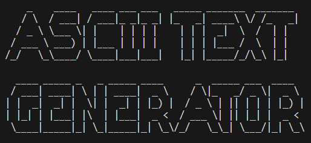

# 💻 GitHub ASCII Text Generator 🎞️


## 📘 Description

A Python project that empowers you to create beautiful ASCII art that represent your text. 

## 📦 Installation

⚙️ You may need to install `pyfiglet`, with `pip`:

```bash
pip install pyfiglet
```

Then you have to clone the git repository:

```bash
git clone https://github.com/X0Rayane/ASCII_Art_Generator-Rayane_GUEROU-CDOF4
```

## 🪧 Usage

Make sure you are on the right directory, the one which you have clone the repository (.../ASCII_Art_Generator-Rayane_GUEROU-CDOF4), 

Then to start use the generator, you had to launch `main.py` with a terminal :

```bash
python main.py
```
So now you will have a quick message like this:
```bash
Enter your text or 'font' to know all the font or 'change_font' to set a new font (type 'exit' to quit): 
```

You have 3 options:
- Enter your the text you want to generate ASCII Art from.
- Type `font` to know all the avalable font.
- Type `change_font` then enter the font you want to use.